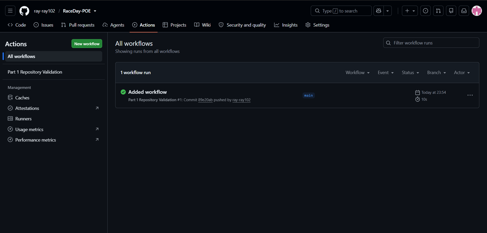

# RaceDay - Event Management Platform


RaceDay is a full-stack web based event management system built for the South African road
running, walking and cycling community. Many local events are still run through paper
registration and spreadsheets, RaceDay brings that process online. Event Organisers can create
and manage events, categories and participant results, while Participants can browse upcoming
events, enter events, and track their personal performance history.

This repository holds the Portfolio of Evidence (POE) for the RaceDay project, submitted in
three parts, each part builds directly on the one before it:

- **Part 1** - System planning, ERD, API endpoint plan and database script (this part)
- **Part 2** - RESTful API built with ASP.NET Core, connected to the Part 1 database
- **Part 3** - MVC web application consuming the Part 2 API, Azure Blob Storage and Docker

## Table of Contents

- [User Roles](#user-roles)
- [Repository Structure](#repository-structure)
- [Planned Tech Stack](#planned-tech-stack)
- [Part 1 Deliverables](#part-1-deliverables)
- [Prerequisites](#prerequisites)
- [Getting Started](#getting-started)
- [Running the SQL Script](#running-the-sql-script)
- [Troubleshooting](#troubleshooting)
- [Design Notes](#design-notes)
- [GitHub and Commit History](#github-and-commit-history)
- [CI/CD](#cicd)
- [Video Walkthrough](#video-walkthrough)
- [Author](#author)

## User Roles

The system supports two distinct user roles, this decision shapes the entire data model and
API plan:

- **Organiser** - can create, edit and delete events, manage event categories, capture
participant results and view all enrolments for their events.
- **Participant** - can create an account, browse events, enter an event by selecting a
category, view their own enrolments and track their personal results.

A user picks their role once, at registration. Role based access is planned at the API level
here in Part 1, will be enforced server-side in the API in Part 2, and reflected consistently in
the MVC interface in Part 3.

## Repository Structure

```
RaceDay-POE/
├── .github/
│   └── workflows/
│       └── part1-validation.yml   # CI workflow that checks this repository structure
├── docs/
│   ├── ERD.png                    # Entity Relationship Diagram, rendered image
│   ├── API-Endpoint-Plan.md       # Full endpoint plan for the whole system
│   └── RaceDay-Schema.sql         # SQL Server script, creates and seeds the database
├── LICENSE
├── .gitignore
└── README.md                      # this file
```

Part 2 and Part 3 will each add their own top level folder (for example `/api` and `/web`) once
those parts begin, the `/docs` folder from Part 1 stays untouched so the original planning
record is preserved for the full project.

## Planned Tech Stack

- **Database:** SQL Server, planned and scripted in Part 1
- **API:** ASP.NET Core Web API with Entity Framework Core (Code-First), built in Part 2
- **Web App:** ASP.NET Core MVC, built in Part 3
- **Cloud Storage:** Azure Blob Storage for event banners and profile pictures, added in Part 3
- **Containerisation:** Docker, added in Part 3
- **CI/CD:** GitHub Actions, expanded with each part

## Part 1 Deliverables

All Part 1 planning documents are committed inside the `/docs` folder, as required by the brief:


| File                        | Description                                                                                                                                                                                      |
| --------------------------- | ------------------------------------------------------------------------------------------------------------------------------------------------------------------------------------------------ |
| `docs/ERD.png`              | Entity Relationship Diagram for the full RaceDay data model, six entities (Roles, Users, Events, Categories, Enrolments, Results) with primary keys, foreign keys and cardinality clearly marked |
|                             |                                                                                                                                                                                                  |
| `docs/API-Endpoint-Plan.md` | Full endpoint plan covering Authentication, User Profile, Events, Categories, Enrolments and Results, with roles, request bodies and expected responses for every route                          |
| `docs/RaceDay-Schema.sql`   | SQL Server script that creates the RaceDay database, all six tables with constraints, and seeds realistic sample data                                                                            |


## Prerequisites

To open and run everything in this repository you will need:

- **SQL Server** (Developer or Express edition, 2019 or later) installed and running
- **SQL Server Management Studio (SSMS)** to open and execute the SQL script
- **Graphviz** (optional) only needed if you want to regenerate `ERD.png` from `erd.dot`
- **Git** to clone the repository and view the commit history

## Getting Started

1. Clone the repository:

```
   git clone https://github.com/ray-ray102/RaceDay-POE.git
   cd RaceDay-POE
```

1. Open SSMS and connect to your local SQL Server instance
2. Follow the steps in [Running the SQL Script](#running-the-sql-script) below
3. Open `docs/API-Endpoint-Plan.md` and `docs/ERD.png` to review the full system plan

## Running the SQL Script

1. Open SQL Server Management Studio (SSMS) and connect to a local SQL Server instance
2. Open `docs/RaceDay-Schema.sql`
3. Click Execute (or press F5), the script drops any existing RaceDayDB, recreates it, creates
  all six tables with their constraints, and seeds sample data (2 Organisers, 2 Participants,
   3 Events, categories per event, sample enrolments and sample results)
4. Expand the RaceDayDB node in Object Explorer to confirm the tables and data were created
5. The last block of the script prints a row count for every table, if all six show a count
  greater than zero the script ran cleanly and seeded correctly

## Troubleshooting

A few issues that can come up the first time the script is run:

- **"Database RaceDayDB already exists"** - this should not happen, the script drops the
database first if it already exists, if it still fails, make sure no other query window has
an open connection to RaceDayDB, then run the script again
- **Login or permission errors** - make sure the SQL Server login you are connected with in
SSMS has permission to create databases, this is normally true for the default `sa` account or
your own Windows login on a local development instance
- **Script runs but tables look empty** - check the Messages tab in SSMS for errors on the
INSERT statements, this usually means a constraint was violated, compare the row you are
looking at against the CHECK constraints defined earlier in the script

## Design Notes

A few decisions made while planning the data model, explained here so the ERD and SQL script
make sense together:

- **Roles is a separate lookup table** rather than a plain text column on Users, this keeps the
two roles (Organiser, Participant) consistent and makes it easy to add a role later without
touching every row in Users.
- **Enrolments sits between Users, Events and Categories** because a single enrolment always
needs to record all three, who entered, which event, and which category they chose.
- **Results has a one-to-one relationship with Enrolments** since a result only makes sense for
a Participant who was actually enrolled, and each enrolment can only be finished once.
- **EventType and Status use CHECK constraints** instead of separate lookup tables since the
list of values is small and unlikely to change, this keeps the schema simpler without losing
data integrity.
- **Cascading deletes are limited on purpose** - deleting an Event cascades to its Categories,
but an Organiser cannot delete an Event or Category that already has enrolments attached to
it, this protects participant data from being lost by accident.

## GitHub and Commit History

This repository is built with real, incremental commits rather than one large upload, each
commit represents one meaningful change such as adding the ERD, writing a section of the
endpoint plan, or refining a constraint in the SQL script. This satisfies the minimum of 20
meaningful commits required for Part 1, and gives an honest record of how the planning came
together.

## CI/CD

A GitHub Actions workflow is configured at `.github/workflows/part1-validation.yml`. It runs on
every push to main or master, and on manual trigger, and checks that:

- the `/docs` folder exists
- the ERD file is present
- the API endpoint plan is present
- the SQL script is present
- a README.md exists at the repository root

Screenshot of a successful green build:



## Author

ST Beraesibe Lelaka